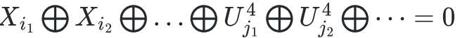
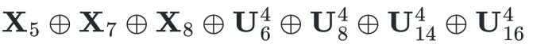
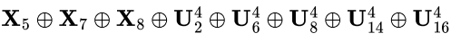
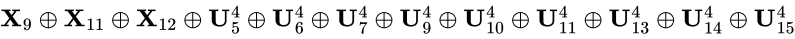

## 密码学第2次书面作业
房书睿 信息安全法学 2213459
### 1.请利用线性密码分析确定 SPN 分组加密算法的(轮)密钥

#### 1.1线性密码分析基本原理


线性密码分析是一种已知明文攻击。攻击者已知密钥相同的多组明密文对，求解密钥。

线性分析法的基本想法是在一个明文比特子集与最后一轮即将进行代换的输入状态比特子集之间找到一个概率线性关系，即存在一个比特子集使得元素的异或表现出非随机的分布。
比如：

如果我们找到一个比特子集，使得子集中元素的异或表现出非随机的分布，也就是异或式具有偏差，即异或取值为0的概率P不等于1/2，|P-1/2|的值越大，则越容易利用线性分析法。我们可以利用上式通过多组明密文分析密钥的值。

具体来看，假设拥有大量使用密钥K的明密文对：
- 对每一个明-密文对，将用所有可能的候选密钥来对最后一轮解密密文；
- 对每一个候选密钥，计算包含在线性关系式中的相关状态比特的异或值，然后确定上述的线性关系是否成立；
   - 如果成立，就在对应于特定候选密钥的计数器上加1；

   - 在这个过程的最后，我们希望计数频率离明-密文对数的一半最远的候选密钥含有那些密钥比特的正确值。
#### 1.2具体分析过程
##### 1.2.1制作线性逼近表

由于选择线性逼近时，需要计算相关随机变量之间的偏差，因此，需要提前列出线性逼近表。SPN的线性逼近表可以通过教材获取，或者编写一个线性逼近表程序`table.cpp`.
该程序的思路为：
- 遍历所有输入和a 与输出和b ；
- 遍历所有S盒输入$X_1$,$X_2$,$X_3$,$X_4$ ，得到输出$Y_1$,$Y_2$,$Y_3$,$Y_4$ ；
- 将二进制表示的a 与$X_1$,$X_2$,$X_3$,$X_4$ 按位取与，二进制表示的b 与$Y_1$,$Y_2$,$Y_3$,$Y_4$ 按位取与，统计二者结果中 的数目，如果为偶数，说明这组随机变量异或值为0，将线性逼近表中相应位置的值加1.

得到的线性逼近表与教材所示相同。

##### 1.2.2线性逼近

根据教程给出的线性分析链，分析出第5轮第2、4部分的密钥。再选择新的线性分析链，在第2、4部分密钥已知的基础上分析出第1、3部分的密钥。
一般来说，一个基于偏差为n 的线性逼近的线性攻击要想获得成功，所需要的明密文对数目T 要接近于$cn^{-2}$ 。在该线性逼近中，$n^{-2}=1024$ ， 取c=8 , 计算可知T=8000 。因此，需要大约 8000对明密文对。


攻击的基本思路如下：

保持对应于候选子密钥的计数器，每当随机变量

取值为0 时，就将对应于该子密钥的记数器加1 (这些计数器的初始值全为0 )。在计数过程的最后，我们希望大多数的计数器值接近于T/2,而真
正的候选子密钥对应的计数器具有接近于T/2± T/32之值，这有助于我们确定正确的 8个子密钥比特。


###### 求解第5轮第2、4部分的密钥$K^{5}_{<2>}$与$K^{5}_{<4>}$

具体步骤分析如下：
1. 输入：明文数组、与之对应的密文数组；
2. 定义计数器二维数组，索引是第5轮第2部分密钥 和 第5轮第4部分密钥的十进制数值，内容全部置为0；
3. 遍历所有明密文对，求解出这两部分密钥：

4. 遍历计数器，计算计数频率离明-密文对数的一半最远(即频率 -T/2最大)的候选密钥含有那些密钥比特的正确值。

这一部分利用`linear_attack.cpp` 中的`K24()`实现。

###### 求解第五轮第1、3部分密钥$K^{5}_{<3>}$与$K^{5}_{<1>}$


基本思路与求解第五轮第2、4部分密钥一致，具体如下：
1. 输入：明文数组、与之对应的密文数组、之前求出的 第5轮第2部分密钥和第5轮第4部分密钥 ；
2. 定义计数器：
 - 一维数组 `count3` ，索引是第5轮第3部分密钥 $K^{5}_{<3>}$
的十进制数值，内容全部置为0；
 - 一维数组 `count1` ，索引是第5轮第1部分密钥 $K^{5}_{<1>}$
的十进制数值，内容全部置为0；
3. 遍历所有明密文对：
 - 遍历所有四位候选子密钥：
    - $v^{4}_{<1>}$ ：密文$y_{<1>}$与密钥$K^{5}_{<1>}$ 异或;
    - $v^{4}_{<2>}$ ：密文$y_{<2>}$与密钥$K^{5}_{<2>}$ 异或;
    - $v^{4}_{<3>}$ ：密文$y_{<3>}$与密钥$K^{5}_{<3>}$ 异或;
    - $u^{4}_{<1>}$ ：$v^{4}_{<1>}$通过S盒逆置换;
    - $u^{4}_{<2>}$ ：$v^{4}_{<2>}$通过S盒逆置换;
    - $u^{4}_{<3>}$ ：$v^{4}_{<3>}$通过S盒逆置换;
    - $u^{4}_{<4>}$ ：$v^{4}_{<4>}$通过S盒逆置换;
    - 计算异或值：
      - 计算
      
      的值，若为0，则`count1`中对应候选密钥计数器+1；
      - 计算的值，若为0，则`count3`中对应候选密钥计数器+1；


4. 分别遍历两个计数器：计数频率离明-密文对数的一半最远(即频率 -T/2最大)的候选密钥含有那些密钥比特的正确值。取8000对明密文对.

至此，我们可以获取完整的第五轮密钥.$K_5$ : 1101 0110 0011 1111
###### 求解完整密钥


我们获得了第五轮密钥$K_5$ 的值。接下来求解完整密钥，在固定后16位密钥的基础上，可以采用穷举的方式，遍历前16位密钥，使用明密文对加以验证，即可得到完整密钥 。

这一部分通过`linear_attack.cpp`中的`k_all()`函数实现，这个函数通过枚举可能的前16位密钥，在每一次枚举的密钥中选择一些已知的明密文进行验证，通过的密钥则为最终的完整密钥
K=0011 1010 1001 0100 1101 0110 0011 1111。


#### 1.3攻击测试
##### 1.3.1生成明密文对

- 利用`generate.py`生成8000对明密文对；
- 这些明密文对会作为加密输入文件，生成密文；
- 利用`merge.py` 将明密文合并为 `input.txt`,这个文档会作为线性攻击的输入文件。

##### 1.3.2求解密钥

将`input.txt`中的8000对明密文对输入到程序中`linear_attack.cpp`中，即可得到最终密钥:K=0011 1010 1001 0100 1101 0110 0011 1111.这与之前设置的加密密钥是一致的。证明线性攻击成功。

 

### 2.请计算国密分组加密算法 SM4 的 SBox 差分分布表

#### 2.1 差分分布计算原理

设$π_s:{0,1}^m→{0,1}^n$是一个S盒。考虑长为m的有序比特串对(x,x),我们称S盒的输入异或为$x$异或$x^*$,输出异或为$π_s(x)异或π_s(x^*)$。注意输出异或是一个n长比特串。对任何$x'$属于$（0,1）^m$,定义集合△(x')为包含所有具有输入异或值x'的有序对(x,x')。对集合△(x')中的每一对，都能计算它们关于S盒的输出异或，然后我们能将所有输出异或的值列成一张结果分布表，一共有$2^m$个输出异或，它们的值分布在$2^n$个可能值之上。

由给出的国密分组加密算法SM4的SBox，我们可知基于此的差分分布表大小为256×256。
关键代码如下
```c++
// Sbox为给出的国密SBox
// len=256
// Sbox_Dif是一个二维数组，用于存储差分分布表，大小为[len][len]
for (int x = 0; x < len; x++) {
    // 遍历S盒的所有可能的输入值y
    for (int y = 0; y < len; y++) {
        // 差分输入表示两个输入值的差异
        int diff_in = x ^ y;
        // 差分输出表示两个输出值的差异
        int diff_out = Sbox[x] ^ Sbox[y];
        // 在差分分布表Sbox_Dif中，以差分输入diff_in为行索引，
        // 差分输出diff_out为列索引的位置增加计数
        Sbox_Dif[diff_in][diff_out]++;
    }
}      //由此我们计算出了整个差分分布表

```

输出差分分布表在 ./第二题/diff_distribution_table.csv